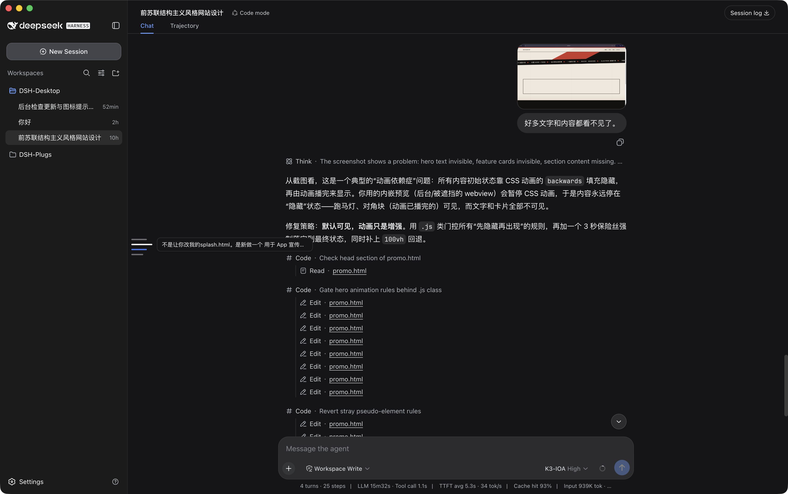

<p align="center">
  
</p>

<p align="center">
  <a href="../README.md">English</a> ｜ <strong>简体中文</strong>
</p>

<h1 align="center">DSH-Desktop</h1>

[DeepSeek Harness](https://github.com/deepseek-ai/deepseek-harness)（DSH）的 Electron 桌面外壳。内置 node + pnpm，把 `@deepseek-ai/dsh` 安装到 `~/.dsh/runtime`，并在浏览器窗口中运行 `dsh web` 界面。

<p align="center">
  
</p>

## 下载与安装

预编译安装包发布在 [GitHub Releases](https://github.com/JustGenius-s/DSH-Desktop/releases)。首次启动会自动安装 DSH 运行时（约 1-2 分钟）。

### macOS

1. 从最新 release 下载 `DSH-Desktop-*.dmg`。
2. 打开 `.dmg`，把 `DSH-Desktop.app` 拖进 `/Applications`。
3. 应用未签名，Gatekeeper 会拦截首次启动。右键应用 → **打开** 并确认，或运行：

```sh
xattr -dr com.apple.quarantine /Applications/DSH-Desktop.app
```

### Windows

1. 从最新 release 下载 `DSH-Desktop Setup *.exe`（安装包）或 `DSH-Desktop-*-win.zip`（便携版）。
2. 运行安装包，或解压后启动 `DSH-Desktop.exe`。
3. 构建未签名，SmartScreen 可能警告。点击 **更多信息** → **仍要运行**。

## 工作原理

```
Electron 主进程
  ├─ 内置 node + pnpm（resources/runtime；开发时用仓库根目录 runtime/）
  ├─ 首次启动：pnpm 安装 @deepseek-ai/dsh → ~/.dsh/runtime（可升级）
  ├─ 启动 dsh web --host 127.0.0.1 --port <空闲端口>
  └─ BrowserWindow → http://127.0.0.1:<端口>
```

DSH 在运行时从 npm 安装，不随应用打包。升级 DSH = 启动时检测到新版本 → 点击 "Update" → 可选择重启网页服务（桌面应用本身不退出），无需重新构建或签名。

## 开发

```sh
pnpm install
pnpm collect      # 下载 node + pnpm 到 runtime/
pnpm start        # 首次启动会安装 @deepseek-ai/dsh（约 1-2 分钟）
```

开发和打包行为完全一致：都用内置 node 和外部 `~/.dsh/runtime`。

## 打包

```sh
pnpm dist:mac     # macOS dmg + zip
pnpm dist:win     # Windows nsis + zip（需在 Windows 上运行）
```

macOS 产物未签名，Gatekeeper 会拦截首次启动。允许方式：

```sh
xattr -dr com.apple.quarantine /Applications/DSH-Desktop.app
```

## 运行时依赖

- node（最新）+ pnpm（最新），通过 `scripts/collect-runtime.mjs` 内置
- `@deepseek-ai/dsh`（npm 最新版），安装到 `~/.dsh/runtime`

## 桌面插件 API

壳把 `window.dshDesktop` 注入到 DSH 网页（`updates` / `seats` / `notify` / `overlays`）。插件应依赖这份契约，而不是 Electron 打包代码。见 [desktop-api.md](desktop-api.md)。

## 我们的插件

配套 DSH 插件见 [DSH-Plugs](https://github.com/JustGenius-s/DSH-Plugs)。

## 致谢

- [Linux do](https://linux.do/)
